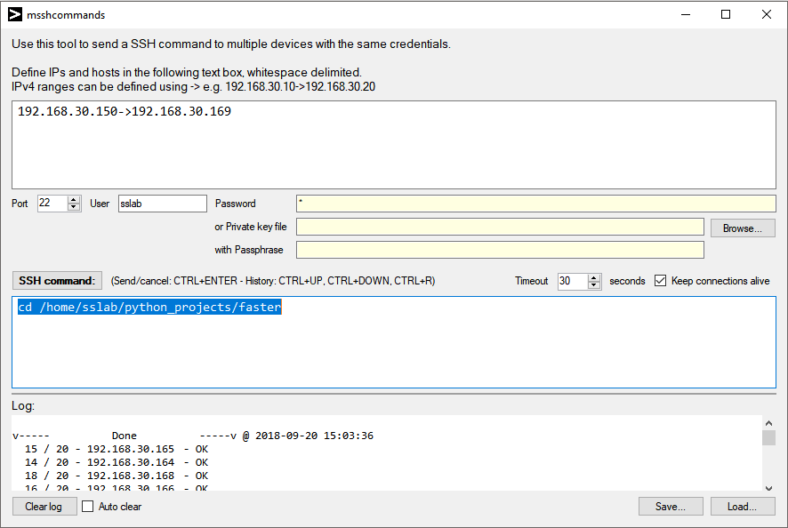

# msshcommands
A small tool to send a SSH command to multiple devices at the same time.

## Prerequisites
Build in C#, .NET Framework 4.5, using Visual Studio 2017 v15.6.6.    
Uses the NuGet Package SSH.NET by Rency v2016.10 for the SSH communication.  
Tested on Windows 10.

You do not need to build it yourself. You can just use the binary in the Build folder.

## Overview

Unchecking *Keep connections alive* closes all current open connections.

When closing the application it remembers all filled in values for when you run it again, except for the password- and passphrase field.

*Save...* only saves the IPs and hosts and the SSH command to a text file.

## ToDo
stderr logging output